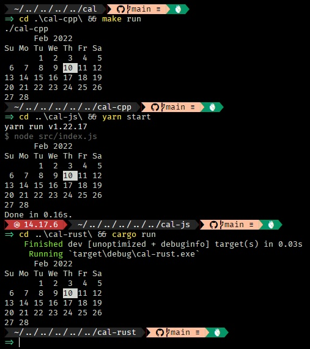

# cal

Different implementations of a terminal application that shows a calendar and highlights the current day in different programming languages

## Implementations

| Language   |          Size |
| ---------- | ------------: |
| C++        |   **149.2kb** |
| JavaScript | 🤣 **29.98mb** |
| Rust       |   **163.5kb** |



## Developing

```bash
git clone https://github.com/princejoogie/cal.git
```

### C++ implementation

```bash
# Run
make run

# Build
make
```

### JavaScript implementation

```bash
# Run
yarn start

# Build
yarn build

# Targeted build
yarn build:(win|mac|linux)
```

### Rust implementation

```bash
# Run
Cargo run

# Build
cargo build --release
```

## Contributing

Feel free to open a PR if you would like to add an implementation in another language

Or submit an issue if any.

Like the project? would appreciate a coffee ☕

[](https://www.buymeacoffee.com/princejoogie)

### Contributor list

[](https://github.com/princejoogie/cal/graphs/contributors)

---

Made by [**Prince Carlo Juguilon**](https://princecaarlo.tech/) together with these awesome [**Contributors**](https://github.com/princejoogie/cal/graphs/contributors).
