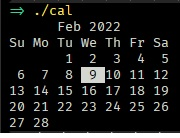

# cal

Show the calendar with current day highlighted in your terminal

> ⚠️ Bloated Version ⚠️
> Written in javascript so binaries include node runtime



## Usage

- Download the binaries in [release](https://github.com/princejoogie/cal-js/releases/) section

## Developing

- Clone the repository

  ```bash
  git clone https://github.com/princejoogie/cal.git
  ```

- Install dependencies

  ```bash
  yarn install
  ```

- Build binaries

  ```bash
  yarn build
  # or build for specific targets
  yarn build:{win|mac|linux} # eg yarn build:win
  ```

## Contributing

See [CONTRIBUTING.md](./CONTRIBUTING.md)

Like the project? would appreciate a coffee ☕

[](https://www.buymeacoffee.com/princejoogie)

### Contributor list

[](https://github.com/princejoogie/cal/graphs/contributors)

---

Made by [**Prince Carlo Juguilon**](https://princecaarlo.tech/) together with these awesome [**Contributors**](https://github.com/princejoogie/cal/graphs/contributors).
